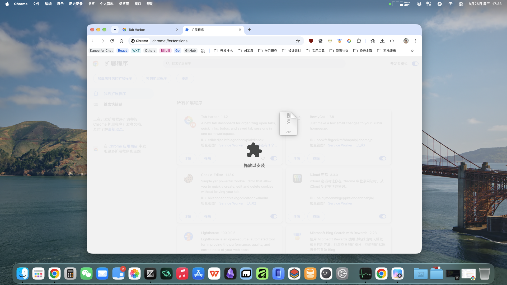

# 安装 Nomu

Nomu 尚未上架 Chrome Web Store，目前通过压缩包手动安装，整个过程不到一分钟。

## 安装步骤

### 1. 下载压缩包

在[落地页](/)点击「添加到 Chrome」按钮，下载 `nomu-<版本号>-chrome.zip`。

<!-- 占位图待补充：落地页下载按钮位置截图，建议文件名 images/install-step-1.png -->

### 2. 打开 Chrome 扩展管理页

在地址栏输入并访问：

```
chrome://extensions
```

### 3. 把 zip 直接拖进页面

确认右上角的**开发者模式**开关已打开，然后直接把下载的 zip 压缩包**拖入**扩展管理页空白处，松手即完成安装——不需要解压。



### 4. 固定到工具栏（推荐）

安装完成后，点浏览器工具栏的拼图图标 🧩，把 Nomu 固定住，方便随时打开侧栏店铺面板。

## 常见问题

### 拖入时提示安装失败

确认开发者模式已开启；如果还是失败，尝试刷新 `chrome://extensions` 后重新拖入。

### 更新版本怎么办？

下载新版本 zip，直接拖入 `chrome://extensions` 覆盖安装即可。店铺设置与批次数据保存在浏览器本地，更新不会丢失。

### 图标点了没反应？

Nomu 的主界面挂在 1688 商品页和 Noon 卖家目录页上——先登录 Noon，再打开对应页面即可看到。
